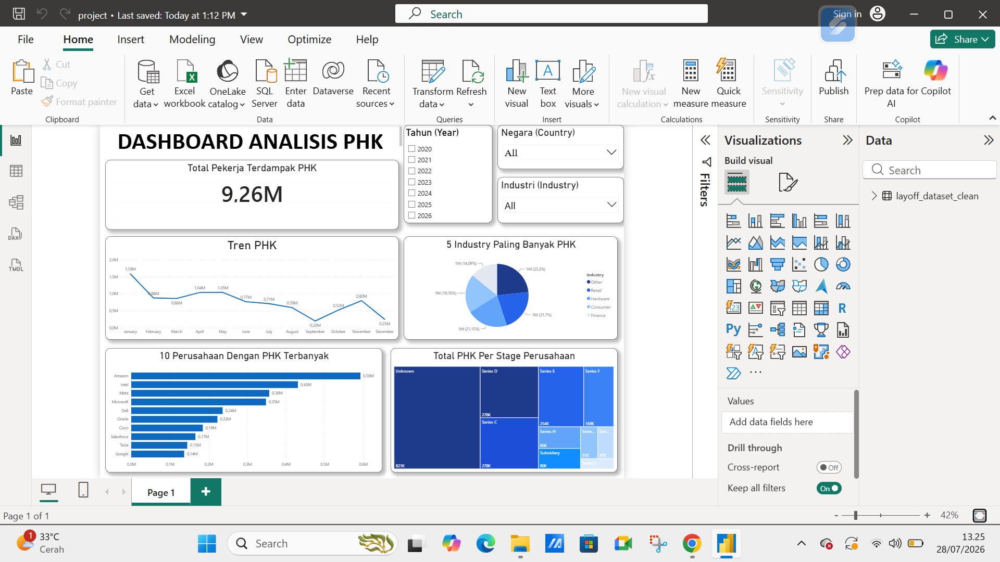

# 📊 Dashboard Analisis PHK Global (Power BI)

 

---

## 📌 Latar Belakang Masalah (Problem Statement)
Gelombang PHK (*layoff*) di berbagai sektor industri global menjadi perhatian besar. Proyek ini bertujuan untuk mengidentifikasi pola, sektor paling terdampak, serta distribusi PHK berdasarkan *stage* pendanaan perusahaan.

## 💡 Key Insights (Temuan Utama)
- **Total Pekerja Terdampak:** Mencapai **9.26 Juta** pekerja secara global.
- **Dampak Berdasarkan Stage:** Perusahaan pada kategori **Post-IPO** mendominasi angka PHK terbesar dibandingkan *stage* startup lainnya.
- **Sektor Teratas:** Industri [Sebutkan Sektor Utama] dan [Sektor Lain] menjadi kontributor terbesar dalam tren PHK ini.

## 🛠️ Tools & Metode
- **MySQL :** penyimpanan data, proses Data cleaning dan agregation, mising value, rows duplikat.
- **Power BI Desktop:** Data modeling, koneksi data base, Pembuatan *visual card*, *line chart*, *treemap*, dan *slicer*.
  

## 📁 Struktur File
- `Analisis_PHK.pbix` : File proyek Power BI.
- `dataset_phk.csv` : Dataset mentah yang digunakan.
- `dashboard_preview.png` : Tangkapan layar tampilan dashboard.
